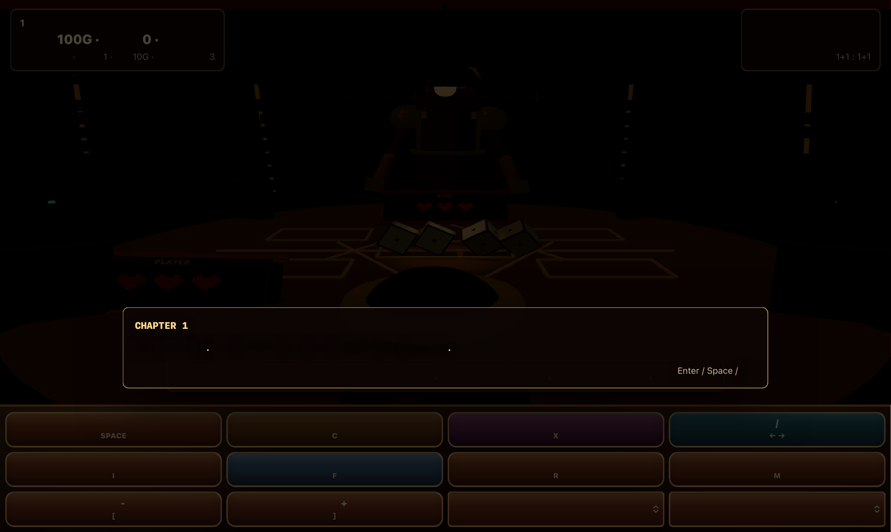
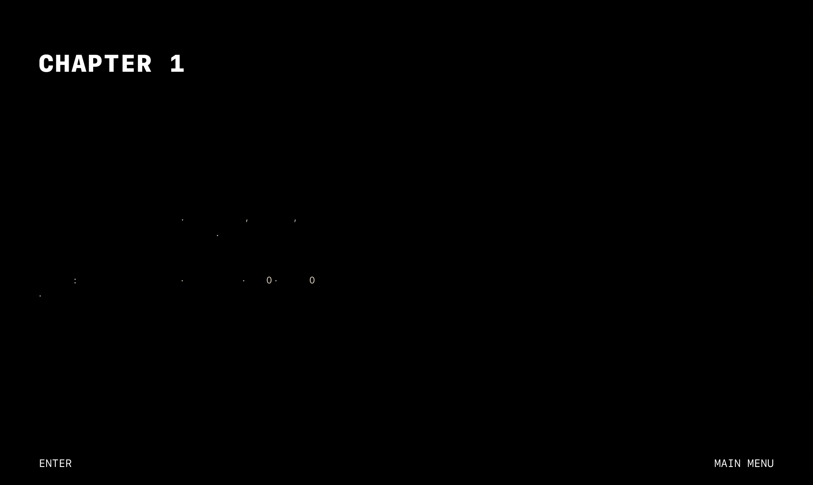
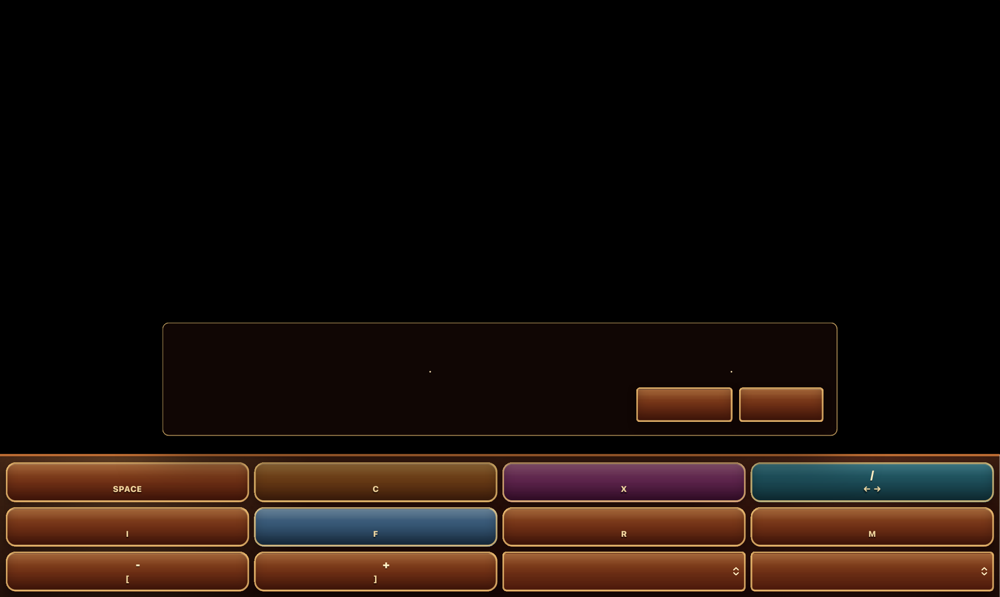

# 붉은 사막의 도박꾼 3D

사막을 건너 빚 문서를 회수하는 여정과 도박장 대결을 결합한 게임.

[브라우저에서 플레이](https://seowooyoo2014.github.io/red-desert-gambler-3d/) · [게임 방법](docs/gameplay.md) · [실행 방법](docs/running.md) · [아키텍처](docs/architecture.md) · [사용 기술](docs/technology.md) · [발전 히스토리](docs/history.md) · [검증](docs/verification.md) · [에셋](docs/assets.md)

## 화면

2026-09-25 독립 복사본의 브라우저 실행 화면에서 촬영했습니다. Safari PDF 내보내기 방식이라 일부 CSS 글자와 어두운 장면은 화면 표시와 다를 수 있습니다.

## 실행

`python3 -m http.server 8000`을 실행하고 `/`를 엽니다. Three.js 로컬 모듈을 사용합니다.
