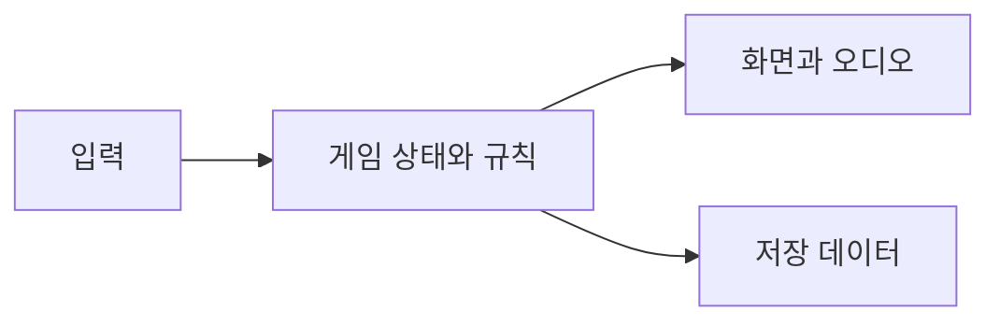

# 아키텍처

`index.html` 단일 게임 파일 안에서 화면·상태·도박 규칙·3D 장면을 관리합니다. Three.js는 `assets/vendor`의 로컬 모듈에서 로드하며 선택 모델·오디오는 없을 때 게임 내부 대체 표현을 사용합니다.

```mermaid
flowchart LR
  I[입력] --> G[게임 상태와 규칙]
  G --> R[화면과 오디오]
  G --> S[저장 데이터]
```
